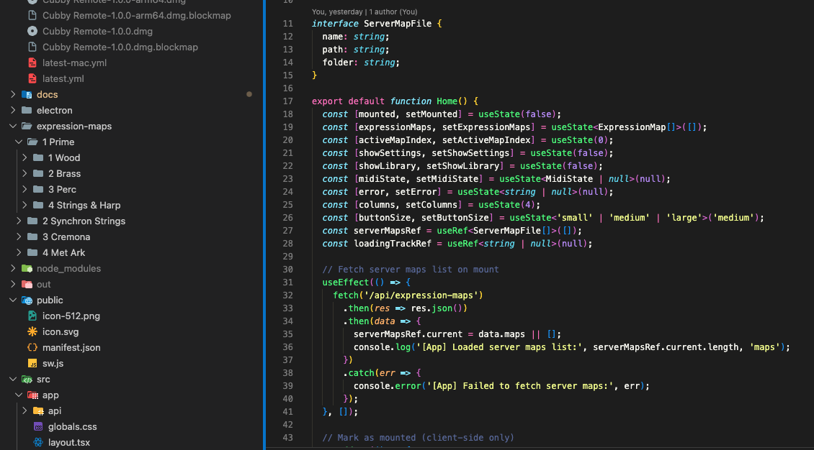

# Cubby Remote

An articulation switcher for Cubase users, designed for iPad/tablet use. Automatically loads expression maps when you select tracks in Cubase, displaying tappable articulation buttons to switch sounds via MIDI.

> **⚠️ This is FREE software.** If you paid for this, you were scammed.
> Official source: https://github.com/willardjansen/cubby-remote

## Features

- **iPad Optimized** - Touch-friendly interface designed for tablets
- **Auto Track Switching** - Automatically loads matching expression map when you select a track in Cubase
- **Server-Side Maps** - Store expression maps on your computer, auto-load on track change
- **Multi-File Drop** - Drop multiple expression maps, auto-merge into one view
- **Instrument Library** - Save and load instrument configurations
- **MIDI Channels** - Merged maps auto-send on correct channels (Ch1-4)
- **Auto-Assign Remotes** - Missing trigger notes are auto-assigned
- **Cubase Colors** - Buttons match your Cubase color coding
- **Search & Filter** - Find articulations in large libraries
- **PWA Support** - Install as an app on your iPad
- **WebSocket Bridge** - Works on iPad without special apps

## Quick Start

### Option 1: Standalone App (Recommended)

**Windows/macOS Installer:**

1. Download the latest release from [Releases](https://github.com/willardjansen/cubby-remote/releases)
   - Windows: `Cubby Remote Setup 1.1.0.exe`
   - macOS Intel: `Cubby Remote-1.1.0.dmg`
   - macOS Apple Silicon: `Cubby Remote-1.1.0-arm64.dmg`
2. Run the installer
   - **macOS users:** If you see "Cubby Remote is damaged", see [macOS Installation Issue](#macos-installation-issue) below
3. Launch "Cubby Remote" from Start Menu or Desktop
4. The app runs in system tray and auto-opens browser to http://localhost:3000

The standalone app includes:
- Built-in MIDI server - no terminal commands needed!
- Quick access Template Builder button in the app header
- MIDI Server Log viewer for troubleshooting (in system tray menu)

### Option 2: Development Mode

For developers or advanced users who want to run from source.

**Prerequisites:**
1. Install Node.js:
   - **Windows:** Install **Node.js v21.6.2** from https://nodejs.org/dist/v21.6.2/node-v21.6.2-x64.msi
     - **Note:** Windows requires this specific version due to native MIDI module compatibility
   - **macOS:** Install the latest Node.js from https://nodejs.org/ (v25+ works fine)
2. Verify installation: `node --version`

```bash
# 1. Install dependencies
npm install

# 2. Start both servers at once
npm run all

# Or separately:
npm run midi    # Terminal 1: MIDI bridge
npm run dev     # Terminal 2: Web server
```

### Access the App

| Device | URL |
|--------|-----|
| Local browser | http://localhost:3000 |
| iPad / Network | http://YOUR_IP:3000 |

**Note:** Your PC can be on Ethernet while iPad is on WiFi - they just need to be on the same network.



## Architecture

```
┌─────────────────────────────────────────────────────────────┐
│                    Windows/Mac Host                          │
│  ┌─────────────┐    ┌──────────────┐    ┌───────────────┐  │
│  │  Next.js    │◀──▶│ MIDI Bridge  │◀──▶│    Cubase     │  │
│  │  Web App    │    │  Server      │    │               │  │
│  │  :3000      │    │  :3001       │    │               │  │
│  └─────────────┘    └──────────────┘    └───────────────┘  │
│         ▲                  ▲                   ▲            │
└─────────│──────────────────│───────────────────│────────────┘
          │ HTTP             │ WebSocket         │ MIDI
          │                  │                   │
     ┌────┴──────────────────┴────┐         loopMIDI (Win)
     │         iPad               │         IAC Driver (Mac)
     │   Safari/Chrome Browser    │
     └────────────────────────────┘
```

### How it Works

- **On Mac/Windows (Chrome)**: Uses Web MIDI API directly
- **On iPad**: Connects via WebSocket to the MIDI Bridge server

## Windows Setup

### 1. Install loopMIDI

1. Download [loopMIDI](https://www.tobias-erichsen.de/software/loopmidi.html)
2. Install and run loopMIDI
3. Create **two** ports:
   - `Browser to Cubase` (for sending articulations)
   - `ArticulationRemote` (for receiving track names)

### 2. Configure Cubase (IMPORTANT)

**Prevent MIDI Feedback Loop:**

1. **Preferences > MIDI** → Uncheck **"MIDI Thru Active"**
2. **Studio > Studio Setup > MIDI Port Setup**:
   - "Browser to Cubase" **Input**: State=Active, In 'All MIDI Inputs'=**Checked**
   - "Browser to Cubase" **Output**: **Uncheck "Visible"**
3. Assign Expression Maps to your tracks

> **Warning:** Without these settings, Cubase may freeze due to a MIDI feedback loop.

### 3. Set Up Auto Track Switching

This enables automatic expression map loading when you select a track in Cubase.

**Install the MIDI Remote Script** (Run PowerShell as Administrator):

```powershell
mkdir "C:\Program Files\Steinberg\Cubase 15\midiremote_factory_scripts\Public\articulation\remote" -Force
copy "cubase-midi-remote\articulation_remote.js" "C:\Program Files\Steinberg\Cubase 15\midiremote_factory_scripts\Public\articulation\remote\"
```

**Configure in Cubase:**

1. Restart Cubase (or click "Reload Scripts" in MIDI Remote Script Console)
2. Open **Studio > MIDI Remote Manager**
3. Click **"+ Add MIDI Controller Surface"**
4. Select **Vendor: articulation**, **Model: remote**
5. Ports should auto-detect to **ArticulationRemote**

**Verify:**
- Open the MIDI Remote Script Console
- Switch tracks - you should see `ART-REMOTE: Track = "TrackName"` messages

### 4. Add Expression Maps to Server

**For Standalone App:**
- Use the system tray menu: **"Add Expression Maps..."** to import files
- Or use **"Open Expression Maps Folder"** and copy files manually
- Location: `C:\Users\USERNAME\AppData\Local\Programs\cubby-remote\resources\expression-maps\`

**For Development Mode:**

Place your `.expressionmap` files in the `expression-maps/` folder:

```
expression-maps/
├── Strings/
│   ├── Amati Viola.expressionmap
│   └── Guarneri Violin.expressionmap
└── Brass/
    └── Trumpets.expressionmap
```

**Important Naming Convention:**
- Track names in Cubase must match expression map filenames for auto-switching to work
- Example: Track named `Amati Viola` matches `Amati Viola.expressionmap`
- Partial matching is supported: `Viola 1` will match `Amati Viola.expressionmap`
- Use the Template Builder (below) to generate projects with exact track names

### 5. DAWproject Template Builder

To solve the track naming challenge, use the built-in **Template Builder** to generate Cubase project templates with track names that exactly match your expression map filenames.

**Access the Template Builder:**
- **In-App Button:** Click the template icon in the top-right corner of the main app
- **Direct URL:** http://localhost:3000/template-builder
- **Standalone App:** Same URL, or use the in-app button

**How to Use:**

1. **Select Expression Maps:**
   - Browse your expression maps folder tree
   - Check folders/libraries you want to include
   - See live count of selected tracks

2. **Generate Template:**
   - Click "Generate DAWproject"
   - Download the `.dawproject` file

3. **Import to Cubase:**
   - File → Import → DAWproject...
   - Select the generated `.dawproject` file
   - Tracks are created with names matching expression map filenames exactly

4. **One-Time Setup:**
   - Assign expression maps to tracks (Cubase remembers by name!)
   - File → Save as Template...
   - Future projects: Start from template with all maps assigned ✅

**CLI Alternative:**

For advanced users, generate templates via command line:

```bash
# Generate template for a specific folder
node generate-dawproject.js "expression-maps/1 Prime/1 Wood" "VSL-Prime-Wood.dawproject"

# Generate template for entire library
node generate-dawproject.js "expression-maps/Spitfire Audio" "Spitfire-Complete.dawproject"

# Multiple templates can be imported and merged in Cubase
```

**Benefits:**
- **Perfect Matching:** Track names exactly match expression map filenames
- **No Fuzzy Matching Issues:** Eliminates ambiguity with large libraries
- **Reusable Templates:** One-time setup, infinite reuse
- **Mix Libraries:** Select from multiple vendors in one template

## macOS Setup

### IAC Driver

1. Open **Audio MIDI Setup** (Applications → Utilities)
2. Go to **Window → Show MIDI Studio**
3. Double-click **IAC Driver**
4. Check **"Device is online"**
5. Add buses: "Browser to Cubase" and "ArticulationRemote"

### Cubase Configuration

1. In **MIDI Port Setup**, check "In 'All MIDI Inputs'" for IAC Driver
2. Assign Expression Maps to tracks

The MIDI Remote script installation is similar to Windows, but in the macOS Cubase folder.

## Usage

### Basic Articulation Switching

1. Start the servers: `npm run all`
2. Open the app on iPad: `http://YOUR_IP:3000`
3. Load an expression map (drag & drop or use Library)
4. Tap articulation buttons to switch sounds in Cubase

### Auto Track Switching

1. Ensure the MIDI Remote script is installed and configured
2. Place expression maps in `expression-maps/` folder (named to match tracks)
3. Select a track in Cubase
4. The web app automatically loads the matching expression map

## Scripts

| Command | Description |
|---------|-------------|
| `npm run dev` | Start web server (network accessible) |
| `npm run midi` | Start MIDI bridge server |
| `npm run all` | Start both servers |
| `npm run build` | Build Next.js for production |
| `npm run electron:dev` | Run Electron app in development |
| `npm run electron:build` | Build standalone installer |
| `npm run electron:pack` | Build unpacked app (no installer) |

**Template Generation:**
```bash
node generate-dawproject.js <folder> <output.dawproject>
```
Or use the web UI at http://localhost:3000/template-builder

## Building from Source

### Prerequisites

**Windows:**
- Install **Node.js v21.6.2** from https://nodejs.org/dist/v21.6.2/node-v21.6.2-x64.msi
- This specific version is required due to native MIDI module compatibility on Windows

**macOS:**
- Install the latest Node.js from https://nodejs.org/ (v25+ works fine)
- Install Xcode Command Line Tools: `xcode-select --install`

### Windows

**Additional Requirements:**
- Windows Developer Mode enabled

**Enable Developer Mode:**
1. Settings → Update & Security → For developers
2. Turn on "Developer Mode"
3. This allows symlink creation without admin privileges

**Build Installer:**
```bash
npm install
npm run electron:build
```

The installer will be at `dist/Cubby Remote Setup 1.1.0.exe`

### macOS

**Build DMG Installers:**
```bash
npm install
npm rebuild midi  # Compile native MIDI module
npm run build     # Build Next.js static export
npm run electron:build
```

**Output Files:**
- `dist/Cubby Remote-1.1.0.dmg` - Universal installer (both architectures)
- `dist/Cubby Remote-1.1.0-arm64.dmg` - Apple Silicon only
- `dist/Cubby Remote-1.1.0-x64.dmg` - Intel only

**Build Notes:**
- The build process creates universal binaries by default
- Native MIDI module (`midi.node`) is compiled for both architectures
- Total build time: ~5-10 minutes on Apple Silicon Macs
- Installer size: ~120-150 MB (includes both architectures)

**Troubleshooting macOS Builds:**
1. If `npm rebuild midi` fails, ensure Xcode Command Line Tools are installed
2. For M1/M2 Macs, Rosetta 2 may be needed for Intel builds: `softwareupdate --install-rosetta`
3. Check build logs in `dist/builder-debug.yml` if the build fails

## Troubleshooting

### macOS Installation Issue

If you see **"Cubby Remote is damaged and can't be opened"** when trying to open the app, this is macOS blocking the application - it's not actually damaged.

**Fix:** Open Terminal and run:

```bash
xattr -cr "/Applications/Cubby Remote.app"
```

Or if the app is still in your Downloads folder:

```bash
xattr -cr ~/Downloads/Cubby\ Remote.app
```

Then try opening the app again.

### iPad shows "MIDI Bridge not running"

Start the MIDI bridge server:
```bash
npm run midi
```

### Cubase hangs/freezes (Windows)

This is caused by a MIDI feedback loop. Fix:
1. Disable MIDI Thru: Preferences → MIDI → Uncheck "MIDI Thru Active"
2. Hide loopMIDI output: Studio Setup → MIDI Port Setup → Uncheck "Visible" for output

### Auto track switching not working

Check each step:
1. **Script Console**: See `ART-REMOTE: Track = "..."` messages?
2. **loopMIDI**: ArticulationRemote showing activity?
3. **midi-server**: See `RAW MIDI IN` messages?
4. **Web app**: Expression map names match track names?

### Articulations not switching in Cubase

1. Verify Expression Map is assigned to the track
2. Check Cubase MIDI input includes the loopMIDI/IAC port
3. Ensure remote triggers are assigned in the Expression Map

### MIDI Server Issues (Standalone App)

**View MIDI Server Log:**
1. Right-click the Cubby Remote system tray icon
2. Select "View MIDI Server Log"
3. Check for error messages about missing MIDI ports or WebSocket failures

**Common Issues:**
- **WebSocket connection failed**: MIDI server not running (check log)
- **No MIDI ports listed**: loopMIDI/IAC Driver not configured
- **Server exits immediately**: Node.js not found in PATH (Windows)

## How It Works

The app sends **remote trigger notes** (not keyswitches) to Cubase:

```
Tap "Legato" button
       │
       ▼
  Note On: C-2  ──────▶  Cubase Expression Map
  Note Off: C-2 ──────▶  receives remote trigger,
                         activates articulation
```

Track switching works via Cubase MIDI Remote:

```
Cubase Track Selection
       │
       ▼
MIDI Remote Script ──────▶ loopMIDI "ArticulationRemote"
(articulation/remote)              │
                                   ▼
                          midi-server.js
                                   │
                                   ▼ WebSocket
                          Web App (loads matching map)
```

## Browser Compatibility

| Platform | Browser | Support |
|----------|---------|---------|
| Windows | Chrome/Edge | Web MIDI |
| Mac | Chrome/Safari | Web MIDI |
| iPad | Safari/Chrome | WebSocket Bridge |
| Any | Firefox | No Web MIDI |

## Project Structure

```
├── src/
│   ├── app/                    # Next.js pages
│   ├── components/             # React components
│   └── lib/
│       ├── expressionMapParser # XML parsing
│       └── midiHandler         # MIDI + WebSocket
├── cubase-midi-remote/
│   └── articulation_remote.js  # Cubase MIDI Remote script
├── expression-maps/            # Server-side maps (you create)
├── midi-server.js              # WebSocket MIDI bridge
└── public/
    ├── manifest.json           # PWA manifest
    └── sw.js                   # Service worker
```

## Support

If you find this useful, please consider supporting development:

[](https://paypal.me/willardjansen)

## License

This project is licensed under the **GNU General Public License v3.0** - see the [LICENSE](LICENSE) file for details.

This means you can use, modify, and distribute this software freely, but any derivative works must also be open source under GPL-3.0.

---

Created by [Willard Jansen](https://github.com/willardjansen)
